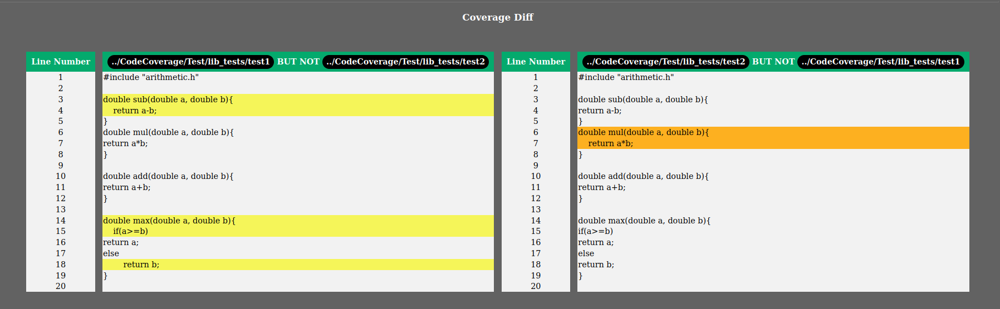
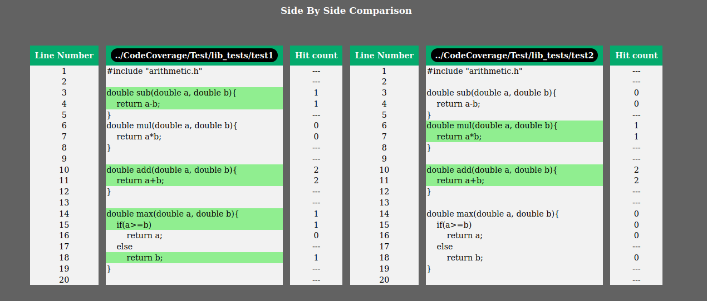

# Pokretanje alata *CovDiff* nad jednostavnim projektom

Alat *CovDif* pokrenut je nad projektom koji sadrži samo jednu datoteku. Datoteka sadži implementaciju funkcija za sabiranje oduzimanje, množenje i pronalaženje maksimuma vrednosti dva realna broja. Sadrža datoteke se može videti ispod:

```C
#include "arithmetic.h"

double sub(double a, double b){
    return a-b;
}
double mul(double a, double b){
    return a*b;
}

double add(double a, double b){
    return a+b;
}

double max(double a, double b){
    if(a>=b)
        return a;
    else
        return b;
}
```

Formirana su dva test primera koja testiraju rad ovih funkcija. 

Prvi test primer:
```C
#include "../lib/arithmetic.h"

int main(){
    sub(10.3, 5);
    add(10,10);
    add(100,100);
    max(1, 5.2);
    return 0;
}
```
Drugi test primer:
```C
#include "../lib/arithmetic.h"

int main(){
    mul(2, 4);
    add(20,20);
    add(45,45);
    return 0;
}
```

Projekat je preved programskim prevodiocem *GCC* uz zadavanje
opcija ```-fprofile-arcs``` i ```-ftest-coverage```. 

Alat *CovDiff* je pokrenut nad ovim projektom sledećom komandom:
```bash
python3 covdiff.py ~/Desktop/CodeCoverage/Test/lib ../CodeCoverage/Test/lib_tests/test1 ../CodeCoverage/Test/lib_tests/test2 ./results_lib ./
```

Razlike u pokrivenosti koda se prave u funkcije za oduzimanje i pronalaženje maksimuma u korist prvog testa, odnosno u funkciji za množenje u korist drugog testa. Prikaz razlika u pokrivenosti koda sa ova dva testa i uporedni prikaz pokrivenih linija se može videti na slikama ispod. Kompletan izeštaj u formatu *html* je dostupan [ovde](./results_lib/html/).

### Prikaz razlika


### Uporedni prikaz
