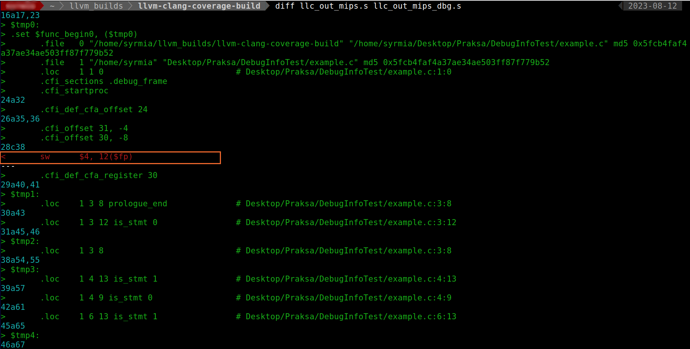

# Testiranje alata *CovDiff* nad jednostavnim projektom

Alat *CovDif* je pokrenut nad projektom koji sadrži samo jednu datoteku. Datoteka sadži implementaciju funkcija za sabiranje oduzimanje, množenje i pronalaženje maksimuma vrednosti dva realna broja. Sadrža [datoteke](./results_lib/arithmetic.c) se može videti ispod:

```C
#include "arithmetic.h"

double sub(double a, double b){
    return a-b;
}
double mul(double a, double b){
    return a*b;
}

double add(double a, double b){
    return a+b;
}

double max(double a, double b){
    if(a>=b)
        return a;
    else
        return b;
}
```

Formirana su dva test primera koja testiraju rad ovih funkcija. 

[Prvi test primer](./results_lib/test1.c):
```C
#include "../lib/arithmetic.h"

int main(){
    sub(10.3, 5);
    add(10,10);
    add(100,100);
    max(1, 5.2);
    return 0;
}
```
[Drugi test primer](./results_lib/test2.c):
```C
#include "../lib/arithmetic.h"

int main(){
    mul(2, 4);
    add(20,20);
    add(45,45);
    return 0;
}
```

Projekat je preveden programskim prevodiocem *GCC* uz zadavanje
opcija ```-fprofile-arcs``` i ```-ftest-coverage```. 

Alat *CovDiff* je pokrenut nad ovim projektom sledećom komandom:
```bash
python3 covdiff.py ~/Desktop/CodeCoverage/Test/lib ../CodeCoverage/Test/lib_tests/test1 ../CodeCoverage/Test/lib_tests/test2 ./results_lib ./
```

Razlike u pokrivenosti koda se prave u funkcijama za oduzimanje i pronalaženje maksimuma u korist prvog testa, odnosno u funkciji za množenje u korist drugog testa. Prikaz razlika u pokrivenosti koda sa ova dva testa i uporedni prikaz pokrivenih linija se može videti na slikama ispod. 

---
> Kompletan izeštaj u formatu *html* dobijen pri ovom pokretanju alata *CovDiff* dostupan je [ovde](./results_lib/html/).
---

### Prikaz razlika


### Uporedni prikaz


# Testiranje alata *CovDiff* nad projektom *LLVM*

Alat *CovDiff* je pokrenut nad projektom *LLVM* kako bi se testirala stabilnost alat pri obradi velike količine informacija o pokrivenosti koda i pri generisanju velike količine stranica u formatu *hrml*.

Projekat *LLVM* je preved uz zadavanje opcija za instrumentalizaciju koda prevodiocu *GCC*. Takođe, navedena je i opcija koja prevodiocu sugeriše da generiše informacije za debagovanje. 

### Komande za kofuguraciju i prevod projekta *LLVM*
```bash
cmake -G "Ninja" -DCMAKE_BUILD_TYPE=Debug \
-DLLVM_ENABLE_ASSERTIONS=On \
-DLLVM_ENABLE_PROJECTS="clang" \
-DCMAKE_C_FLAGS="--coverage" \
-DCMAKE_CXX_FLAGS="--coverage" \ 
-DCMAKE_CXX_STANDARD_LIBRARIES="-lgcov" \
-DCMAKE_C_STANDARD_LIBRARIES="-lgcov" \
~/Desktop/llvm-project/llvm
```
```bash
ninja -j1
```

U izvornom kodu projekta *LLVM* je napravljena namerna greška ubacivanjem dela koda koji briše jednu instrukciju iz prvog osnovnog bloka. Deo koda je ubačen u okviru prolaza [*RemoveRedundantDebugValues*](https://llvm.org/doxygen/RemoveRedundantDebugValues_8cpp.html). Kako prolaz obrađuje samo debag informacije, ostale instrukcije moraju ostati nepromenjene, pa iz tog razloga ubačen deo koda predstavlja grešku.

### U prolaz *RemoveRedundantDebugValues* je ubačen sledeći kod


Formirana su dva test primera na međureprezentaciji *LLVM IR* na osnovu koda jednostavne funkcije koja se može videti ispod:
```C
int foo(int a, int b){
    int c;
    if(a > b)
        c = a;
    else
        c = b;
    return c;
}
```
Ovaj kod je dostupan [ovde](./results_llvm/example.c).

Prvi test ```example_mips_dbg.ll``` je formiran pozivom alata [*Clang*](https://clang.llvm.org/) uz zadavanje opcije `-g` koja alatu sugeriše da generiše informacije za debgovanje. Komanda kojom je test primer dobijen je sledeća:
```bash
./bin/clang --target=mips -g -S -O0 -emit-llvm example.c -o example_mips_dbg.ll
```

Drugi test ```example_mips.ll``` je formiran na isti način ali **bez zadavanja opcije** `-g`:
```bash
./bin/clang --target=mips -S -O0 -emit-llvm example.c -o example_mips.ll
```

Izvorni kod testa ```example_mips_dbg.ll``` je dostupan [ovde](./results_llvm/example_mips_dbg.ll), dok je izvorni kod testa ```example_mips.ll``` dostupan [ovde](./results_llvm/example_mips.ll).

Oba test primera za ciljnu arhitekturu imaju arhitekturu [*MIPS*](https://www.mips.com/products/architectures/). Razlikuju se samo po prisustvu informacija za debagovanje. Cilj toga je da se pri pokretanju alata *CovDiff*, u razlikama u pokrivenosti koda projekta *LLVM* prvim i drugim testom, nađe greška koja je ubačena u prolaz *RemoveRedundantDebugValues*. To je posledica toga što prvi test sadži informacije za debagovanje pa će razlike u njegovu korist biti svi delovi projekta *LLVM* koji obrađuju informacije za debagovanje.


Za pokretanje testova korišćen je alat [*llc*](https://llvm.org/docs/CommandGuide/llc.html). Alatu *llc* se prosleđuju dva testa na osnovu kojih se generiše asmblersi kod na arhitekturi *MIPS*.

Komanda kojom se generiše asmblerski kod za prvi test:
```bash
./bin/llc -mtriple=mips -O2 example_mips_dbg.ll -o llc_out_mips_dbg.s 
```

Komanda kojom se generiše asmblerski kod za drugi test:
```bash
./bin/llc -mtriple=mips -O2 example_mips.ll -o llc_out_mips.s
```
Asemblerski kod `llc_out_mips_dbg.s` za prvi test je dostupan [ovde](./results_llvm/llc_out_mips_dbg.s), dok je asemblerski kod `llc_out_mips.s` za drugi test dostupan [ovde](./results_llvm/llc_out_mips.s).

Iako se testovi razlikuju samo po prisustvu informacija za debagovanje, generisani asemblerski kod neće biti isti zbog greške napravljene u prolazu *RemoveRedundantDebugValues*. Razlika u asmblerskom kodu za ova dva test primera se može videti na slici ispod. Razlike se, pored instrukcija za debagovanje, prave i u jednoj instrukciji `sw` (*store word*) koja je obrisana u prolazu *RemoveRedundantDebugValues*.

### Razlike u asmblerskom kodu testova



**Cilj je pomoću alata *CovDiff* uočiti deo izvornog koda projekta *LLVM* koji je odgovoran za ovu grešku.  Alat je pokrenut nad direktorijumom u kojem je prevedn projekat *LLVM* i na ulazu su zadata dva formirana test primera.**


Alat *CovDiff* je pokrenut sledećom komandom:
```bash
python3 covdiff.py ~/llvm_builds/llvm-clang-coverage-build  ../DebugInfoTest/example_mips_dbg.ll ../DebugInfoTest/example_mips.ll ./results_llvm ~/llvm_builds/llvm-clang-coverage-build/bin/llc mtriple=mips O2 o llc_out.s
```

Alat *CovDiff* je pri ovom pokretanju obradio 1293 datoteka formata *.gcda* nastalih nakon pokretanja testa ```example_mips_dbg.ll``` i 1247 datoteka formata *.gcda* nastalih nakon pokratanja testa  ```example_mips.ll```. 

---
> Kompletan izeštaj u formatu *html* dobijen pri ovom pokretanju alata CovDiff dostupan je [ovde](./results_llvm/html/).
---

Na slici ispod se može videti da je ubačeni deo koda u prolaz *RemoveRedundantDebugValues* prisutan u razlikama u pokrivenosti koda projekta *LLVM* prvim testom u odnosu na drugi test. Pregledom tih rezultata korisnik alata može lako uočiti grešku u izvornom kodu projekta *LLVM* i otkloniti je.

### Greška u prolazu *RemoveRedundantDebugValues* vidljiva u prikazu razlika

